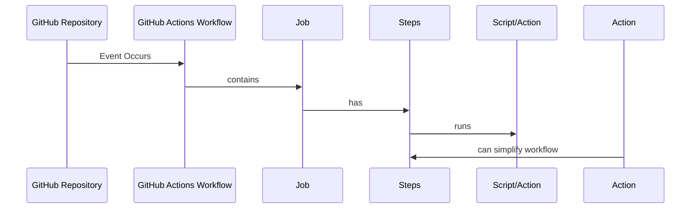

## Components of GitHub Actions

- GitHub Actions can be triggered by events in your repository
- Workflows contain one or more jobs
- Jobs can run sequentially or in parallel
- Each job runs in its own virtual machine runner or container
- Jobs contain one or more steps
- Steps run a script or action
- Actions are reusable extensions that simplify workflows

## Workflows

- A workflow is a configurable automated process that runs one or more jobs.
- Workflows are defined by a YAML file checked into the repository.
- Workflows can be triggered by an event in the repository, manually, or on a schedule.
- Workflows are defined in the .github/workflows directory in a repository.
A repository can have multiple workflows, each performing a different set of tasks.
- Workflows can be used for tasks like building and testing pull requests, deploying applications when a release is created, or adding a label when a new issue is opened.

## Events

- An event is a specific activity in a repository that triggers a workflow run.
- Activities that can trigger a workflow include creating a pull request, opening an issue, or pushing a commit to a repository.
- Workflows can also be triggered on a schedule, by posting to a REST API, or manually.

## Jobs

- A job is a set of steps in a workflow executed on the same runner.
- Each step is either a shell script or an action that runs in order and is dependent on each other.
- Steps executed on the same runner can share data from one step to another.
- Jobs can be configured with dependencies on other jobs, and by default, jobs run in parallel.
- When a job takes a dependency on another job, it will wait for the dependent job to complete before it can run.
- You may have multiple build jobs for different architectures that run in parallel with no dependencies, and a packaging job that depends on those jobs.

## Actions

- An action is a custom application for the GitHub Actions platform that performs a complex but frequently repeated task.
- Use an action to help reduce the amount of repetitive code that you write in your workflow files.
- An action can pull your git repository from GitHub, set up the correct toolchain for your build environment, or set up the authentication to your cloud provider.
- You can write your own actions, or you can find actions to use in your workflows in the GitHub Marketplace.

## Runners

- A runner is a server that runs your workflows when they're triggered.
- Each runner can run a single job at a time.
- GitHub provides Ubuntu Linux, Microsoft Windows, and macOS runners to run your workflows.
- Each workflow run executes in a fresh, newly-provisioned virtual machine.
- GitHub also offers larger runners, which are available in larger configurations.

